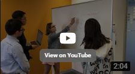
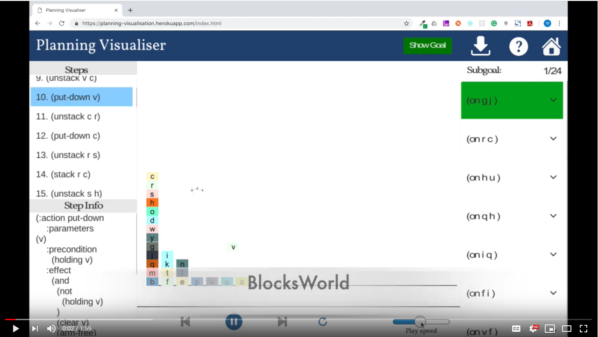
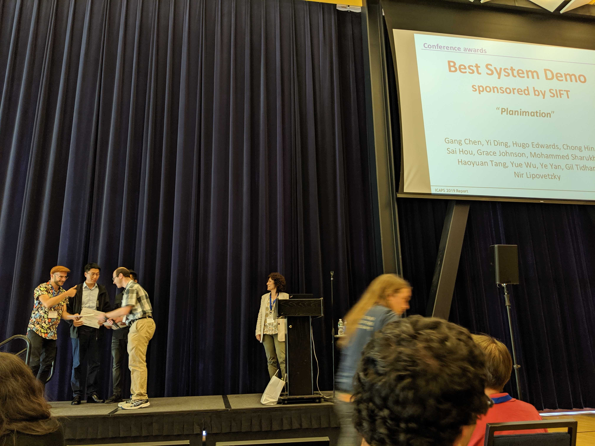
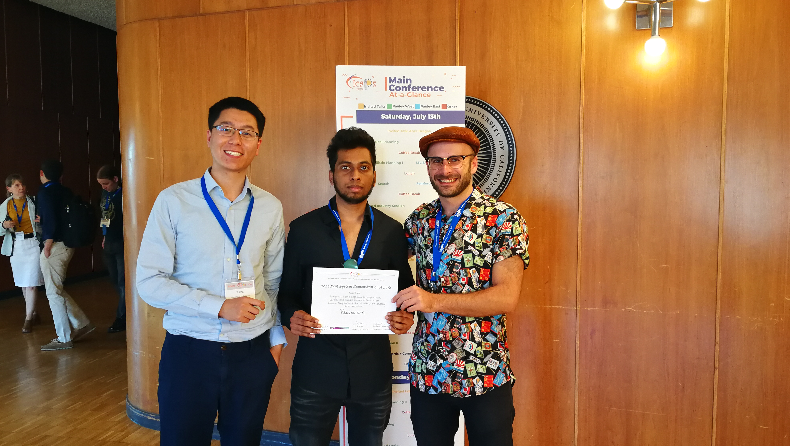

# Planimation

Planimation is a modular and extensible open source framework to visualise sequential solutions of planning problems specified in PDDL. We introduce a preliminary  declarative PDDL-like animation profile specification, expressive enough to synthesise animations of arbitrary initial states and goals of a benchmark with just a single profile.

## 1 Overview 

Planimation was developed as a final year project by students at the Univeristy of Melbourne. Here's a promotional video explaining the motivation behind planimation.

[](https://youtu.be/FEm5ZQM-b3Y)

Planimation is an open-source program which visualises solutions to Planning Problems. It is an executable Unity architecture in a browser.

Watch the video below for a 2 minutes introduction about Planimation.

[](https://youtu.be/Cj2rWdt1YQU)


For developer documentation, see

1. [Animation Profile Guide](https://planimation.github.io/documentation/ap_guide/)
    * Contains a guide to Animation Profiles and the Animation Profile Language
2. [Backend Dev. Guide](https://planimation.github.io/documentation/VFG_guide/)
    * Contains a guide to the Visualisation File Generator Component
3. [Frontend Dev. Guide](https://planimation.github.io/documentation/Visualiser_guide/)
    * Contains a guide to the VisualiserComponent 
	

### 1.1 Planning Problems

For information about Planning Problems, see [http://planning.domains/](http://planning.domains/)


Our application uses one 'Animation Profile' per problem domain. An Animation Profile is a user-written PDDL file which tells the Visualiser how a Domain is to be visualised. See section 3.2 for more information on Animation Profiles.


### 1.2 Scope
Planimation currently has [Animation Profiles](https://github.com/planimation/documentation/tree/master/AnimationProfiles) for four classic planning domains: Blocks, Grid, Towers of Hanoi, and Logistics. We also include Animation profiles of other classic combinatorial problems based on [Missionaries and Cannibals](https://en.wikipedia.org/wiki/Missionaries_and_cannibals_problem). 

Animation profiles for new domains may be added by writing an Animation Profile ([See guide](ap_guide.md)).


Planimation can animate plans generated by the AI solver available on [http://editor.planning.domains](http://editor.planning.domains). Alternatively, the user can provide their own solution from any solver, provided it conforms to the correct format.


## 2 Getting Started

1. Try planimation within the [online PDDL editor](https://tinyurl.com/yxlt96fp). Comes preloaded with files to planimat Blocks. Planimation is installable from the plugin menu.

    
2. Alternatively, visit our stand alone application at [http://planimation.planning.domains](http://planimation.planning.domains)

## 3 Papers

- [ICAPS 2019 System Demonstrations](https://arxiv.org/pdf/2008.04600.pdf)

- [KEPS book: Plannimg.domains](https://link.springer.com/chapter/10.1007/978-3-030-38561-3_5#readcube-epdf)

## 5 Awards

### 5.1 ICAPS 2019 Best System Demonstration

This document contains an overview of Planimation, recipient of the [ICAPS 2019 Best system Demo Award](https://icaps19.icaps-conference.org/awards).




### 5.2 Melbourne School of Engineering - Endeavour 2018

[Endeavour Exhibition](https://endeavour.unimelb.edu.au/past/2018-endeavour-exhibition) discovers final-year industry, design and research projects developed by our engineering and IT masters students.


## 6 Citing Planimation

Please cite Planimation using
``` latex
@article{chen2020planimation,
  author       = {Chen, Gan and
                  Ding, Yi and
                  Edwards, Hugo and
                  Chau, Chong Hin and
                  Hou, Sai and
                  Johnson, Grace and
                  Sharukh Syed, Mohammed and
                  Tang, Haoyuan and
                  Wu, Yue and
                  Yan, Ye and
                  Tidhar Gil and
                  Lipovetzky Nir},
  title        = {Planimation},
  journal      = {arXiv preprint arXiv:2008.04600},
  year         = {2020}
}
```