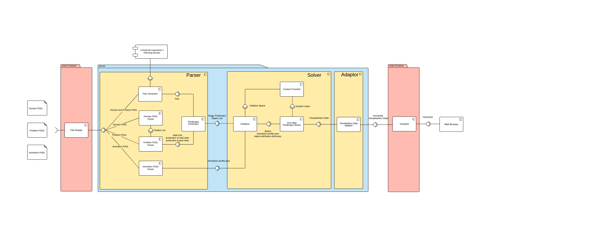
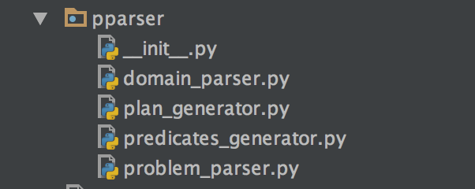
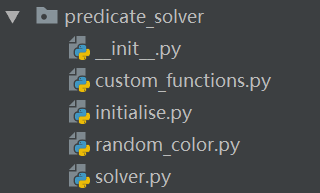
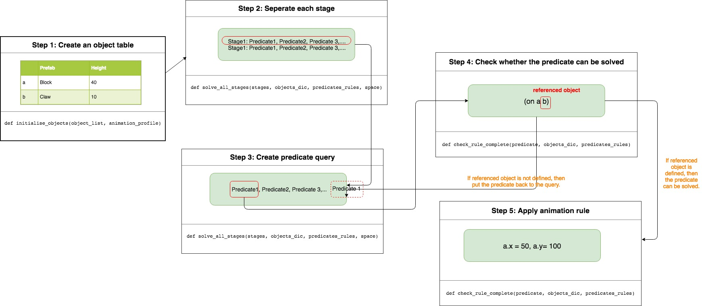
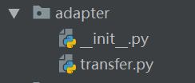

#  Backend - Visualisation File Generator (VFG)


This document explains the functioning of the Visualisation File Generator (VFG) for the purposes of development. For deployment and the user guide, see README.md.

The VFG decides where objects are on the screen and what they look like.

Most domain-related modifications to the system should be made to the VFG. For example, a new domain might require objects to be laid out in a manner which is not captured in the existing Animation Profile language.
Extending the Visualisation File Generator requires only building the project in Django (see section 2.2 of README.md).
Modifications or extensions of the VFG need only be carried out only on the Django server (not Unity).


## 1 Getting Started


To build the VFG, see (See [Deployment](deployment_guide.md))


## 2 Overview


* Input files:

    *   Domain PDDL file
    *   Problem PDDL file
    *   Animation Profile

* Output file:
    *   Visualisation file


### 2.1 Overall Architecture:



 

## 3 Components


### 3.1 Parser 




Here is the code structure of parser. The **Parser component** gets domain PDDL file, problem PDDL file, animation PDDL file and plan PDDL file and parsers these files into**predicates list** and **animation profile json** to feed **Solver component**.

####  Plan_generator.py


Send domain file and problem file to planning.domain API and gets the solution file.
```python
def get_plan(domain_file, problem_file):  
```
*   This function will send the domain and problem pddl file to the planning.domain  API to get the plan

#### Domain_parser.py

Transfer domain file into a list of predicates and record all possible predicates in this domain.
```python
def get_domain_json(file_name): 
```
*   This function transfers domain file to a list of predicates.
*   Regular expression is used to get the result.

Here is an example of the **output**:
```
{
    "on": 2,
    "on-table": 1,
    "clear": 1,
    "arm-free": 0,
    "holding": 1
}
```
  

#### Problem_parser.py

Interprete problem file and get all predicates for INIT and GOAL stages
```python
def get_object_list(predicates_lists,str_init):  
```

*   This function gets object list of the domain from predicate list

```python
def get_regex_list(predicates_lists):  
```
*   This function changes the format of predicate list

```python
def get_problem_json(file_name, predicates_lists):
```

*   This function parse the problem PDDL file and get the initial predicates and goal predicates.

Here is an example of the **output**:
```
[{
    "init": [{
        "name": "on",
        "objectNames": ["c", "b"]
    }, {
        "name": "on-table",
        "objectNames": ["a"]
    }, {
        "name": "on-table",
        "objectNames": ["b"]
    }, {
        "name": "on-table",
        "objectNames": ["d"]
    }, {
        "name": "clear",
        "objectNames": ["a"]
    }, {
        "name": "clear",
        "objectNames": ["c"]
    }, {
        "name": "clear",
        "objectNames": ["d"]
    }, {
        "name": "arm-free",
        "objectNames": ["No objects"]
    }]
}, {
    "goal": [{
        "name": "on",
        "objectNames": ["a", "b"]
    }, {
        "name": "on",
        "objectNames": ["b", "c"]
    }, {
        "name": "on",
        "objectNames": ["c", "d"]
    }],
    "goal-condition": ["and"]
}]
```
  

#### Predicates_generator.py

Interpret solution file and get all predicates for every stage in solution file.
```python
def remove_unused_char(action_list):  
```

*   This function removes all the useless characters from solution file.
```python
def get_action_name(current_step):  
```

*   This function returns the action name of the current step.
```python
def get_stages(plan, problem_dic, problem_file, predicates_list):
```

*   This function gets the predicates for each stage.

#### Parser Output: Predicate List of all stages

##### Description
The predicate list is generated by **Parser Component** and feeds **Solver Component**. It includes all the **predicates for each stage** and the **object list** for the problem. Using the result of predicate list and animation profile, the solver can apply the one-way constraint solver to calculate the visualisation result. The object list can be used in the initialisation of the solver.
##### Format
The format for predicate list and object list is:

```json
{
"stages": [{ --stage list
"items": [{ -- predicate list in each stage
"name": , -- predicate rule
"objectNames": -- objects to be referenced
}],
"add": , -- compared to previous stage, what predicates are added
"remove": , -- compared to previous stage, what predicates are removed
"stageName": , -- name of the stage
"stageInfo": -- stage information
} ],
"objects": -- object list in the problem
}
```
##### Example
Here is an example of the predicate list for Blocks domain.
```json
{
"stages": [{
"items": [{
"name": "on",
"objectNames": ["c", "b"]
}, {
"name": "on-table",
"objectNames": ["a"]
}, {
"name": "on-table",
"objectNames": ["b"]
}, {
"name": "on-table",
"objectNames": ["d"]
}, {
"name": "clear",
"objectNames": ["a"]
}, {
"name": "clear",
"objectNames": ["c"]
}, {
"name": "clear",
"objectNames": ["d"]
}, {
"name": "arm-free",
"objectNames": ["No objects"]
}],
"add": "",
"remove": "",
"stageName": "Initial Stage",
"stageInfo": "No Step Information"
}, {
"items": [{
"name": "on-table",
"objectNames": ["a"]
}, {
"name": "on-table",
"objectNames": ["b"]
}, {
"name": "on-table",
"objectNames": ["d"]
}, {
"name": "clear",
"objectNames": ["a"]
}, {
"name": "clear",
"objectNames": ["d"]
}, {
"name": "clear",
"objectNames": ["b"]
}, {
"name": "holding",
"objectNames": ["c"]
}],
"add": [{
"name": "clear",
"objectNames": ["b"]
}, {
"name": "holding",
"objectNames": ["c"]
}],
"remove": [{
"name": "on",
"objectNames": ["c", "b"]
}, {
"name": "clear",
"objectNames": ["c"]
}, {
"name": "arm-free",
"objectNames": ["No objects"]
}],
"stageName": "unstack (c b)",
"stageInfo": "(:action unstack\r\n :parameters (c b)\r\n :precondition\r\n (and\r\n (on c b)\r\n (clear c)\r\n (arm-free)\r\n )\r\n :effect\r\n (and\r\n (holding c)\r\n (clear b)\r\n (not\r\n (clear c)\r\n )\r\n (not\r\n (arm-free)\r\n )\r\n (not\r\n (on c b)\r\n )\r\n )\r\n )"
}],
"objects": ["b", "d", "c", "a"]
}
```
### 3.2 Solver 

####  Overview



Here is the code structure of solver. This module will generate the visualisation file by using the predicates of all stages and animation profile.

*   custom_function.py:
    *   This module contain all the customer function we designed to help position the objects.
*   initialise.py:
    *   This component is used to initialise the environment and objects for Predicate Solver.
*   random_color.py:
    *   This function will provide a randomly selected colour for Initialise to use.
*   solver.py:
    *   This module will compute the visualisation file by using the stages predicates and animation.

This module will generate the visualisation file by using the predicates of all stages and animation profile.

Here is the algorithm diagram of our constraint solver:



Here is the link for this diagram: [https://www.draw.io/#G12sCLukE55c_9VOKCJZqUiMh7OWFeaAXJ](https://www.draw.io/#G12sCLukE55c_9VOKCJZqUiMh7OWFeaAXJ)

For instance, here are the predicates that need to be solved:
```
(On-table a)
(On b a)
(On c b)
```
In the predicates, the object ahead is the object to be solved and the object behind is the predefined object. To calculate the position of "c", we must know the position of "b". Similarly, to calculate the position of "b", we must know the position of "a". From (on-table a), we can know the position of a, so "b" is solved and then "c" is solved. The diagram below shows how the objects are referenced.


  

  
#### Steps

There are 5 main steps in the algorithm of constraint solver:

##### Create an Object Table (initialise.py , random_color.py)

```python
def initialise_objects(object_list, animation_profile):  
```

This function will initialise objects in the animation profile and use a dictionary to store all the objects and their attributes.

In the dictionary, it will store all objects and their attributes, as shown in the table below:

  |         | prefab           | name  |color        | height           | width  |y        | x           | showName  |
| --- |:-----:| ---:|:-----------------: |:-------:| -----:|----:|------------- |:-------------:|
| a      | Block |a|"a": 1, "r": 0.41, "b": 0.41, "g": 0.55 |40|80|false|false|true|


Here is a simple example of object dict:
```
"a": {
        "prefab": "Block", 
        "name": "a", 
        "color": {
            "a": 1, 
            "r": 0.41, 
            "b": 0.41, 
            "g": 0.55
        }, 
        "height": 40, 
        "width": 80, 
        "y": false, 
        "x": false, 
        "showName": true
    }
```
##### Separate Each Stage (customer_functions.py, solver.py)
```python
def solve_all_stages(stages, objects_dic, predicates_rules, space):  
```

This function will seperate each stage in stages list and run through each stage which contains a list of predicates and solve all the predicates.

The stages list is like:

Stage1: Predicate1, Predicate2, Predicate3,....
Stage2: Predicate1, Predicate3, Predicate3,...
...

Here is a simple example of one stage:
```
{
    "items": [
        {
            "objectNames": [
                "c"
            ], 
            "name": "on-table"
        }, 
        {
            "objectNames": [
                "a"
            ], 
            "name": "clear"
        }, 
        {
            "objectNames": [
                "b"
            ], 
            "name": "on-table"
        }, 
        {
            "objectNames": [
                "c", 
                "a"
            ], 
            "name": "on"
        }
    ]
}
```
##### Create Predicate Query (customer_functions.py, solver.py)

```python
def solvepredicates(predicates, objects_dic, predicates_rules, space):  
```

This function will store all predicates in a query and pop a predicate from predicates list, and try to solve it by calling check_rule_complete and applypredicates function. If it can be solved, then it will be removed from the query, if it can not be solved yet, it will be put back to the predicate list. The function will return true until all predicates are solved.

The predicate lists will be separated like:
```
Predicate1, Predicate2, Predicate3,....
```
If predicate1 is solved then the predicate list will remove predicate1 and start to solve predicate 2:
```
Predicate2, Predicate3,....
```
If predicate 1 can't be solved, then it will be put back to the query:
```
Predicate2, Predicate3,....Predicate1
```
#####  Check whether predicate can be solved (customer_functions.py, solver.py)


```python
def check_rule_complete(predicate, objects_dic, predicates_rules):  
```


This function will check whether this predicate can be solved. 

For example, here is a predicate for object a and c:
```
 {
            "objectNames": [
                "c", 
                "a"
            ], 
            "name": "on"
        }
```
The predicate rule is "on" and the objects are "a" and "c". In this predicate, "a" is the referenced object, so to define the position of "c", we must know the position of "a". If a's value has not be defined, the function will return false because this predicate can't be solved for now.

##### Apply Animation Rule (customer_functions.py, solver.py)
```python
def applypredicates(predicate,objects_dic,predicates_rules,space):
```

This object will update the value of related object in the object list by applying the animation rule.  

For example:
```
(on-table a)
```
Using distributex function in the extensions, a's y value is set to 0.
```
a.y = 0
```
### 3.3 Adaptor 



Here is the code structure of adapter. This component transfers the result generated by Predicate Solver into the final visualisation file.

```python
def transfer(one_stage, initialobjects, panel_size,shiftx,shifty, padding=20):
```

This function converts the dictionary into the info needed in visualisation file.
```python
def get_panel_size(result, padding=20):
```
This function will for loop all the objects in the visualisaiton dictionary, and try to find the max_x and max_y of the panel.

For example, 
```
.........max_y
.        .
.        .
.        .
........max_x
```
```python
def generate_visualisation_file(result, object_list,animation_profile):  
```
```python
def get_visualisation_json(predicates, animation_profile):
```
These functions are the main functions of this module,they will call the other functions to manipulate the visualisation file for the unity visualiser.
```
"shape": {
  "Block": {
    "prefab": "Block",
    "showName": true,
    "x": false,
    "y": false,
    "color": "randomcolor",
    "width": 80,
    "height": 40
 },
  "Claw": {
    "prefab": "Claw",
    "color": {
      "r": 0,
      "g": 0,
      "b": 0,
      "a": 1
 },
    "showName": false,
    "x": 230,
    "y": 500,
    "width": 80,
    "height": 40
 },
```
  

#### Visualisation File Structure


Visualisation Files are in JSON. 


They contain
* a list of visual stages, containing
    * a list of visual sprites. 
        * Each Visual sprite has a number of properties, outlined below
    * Stages also contain a name and a list of predicates true at that stage
* A table of images (base64) for visualisation
* Subgoal map and pool, for displaying data about subgoals


An example Visualisation file is shown below. It is for the Blocks domain, and it has only 2 stages.
    
 
```json
{
    "visualStages": [{
        "visualSprites": [{
            "prefabImage": "Block",
            "showName": true,
            "x": 100,
            "y": 0,
            "color": {
                "r": 0.8,
                "g": 0.52,
                "b": 0.25,
                "a": 1.0
            },
            "width": 80,
            "height": 80,
            "name": "b",
            "minX": 0.207,
            "maxX": 0.345,
            "minY": 0.034,
            "maxY": 0.172
        }, {
            "prefabImage": "Block",
            "showName": true,
            "x": 200,
            "y": 0,
            "color": {
                "r": 0.5,
                "g": 1.0,
                "b": 0.83,
                "a": 1.0
            },
            "width": 80,
            "height": 80,
            "name": "d",
            "minX": 0.379,
            "maxX": 0.517,
            "minY": 0.034,
            "maxY": 0.172
        }, {
            "prefabImage": "Block",
            "showName": true,
            "x": 100,
            "y": 82,
            "color": {
                "r": 1.0,
                "g": 0.76,
                "b": 0.76,
                "a": 1.0
            },
            "width": 80,
            "height": 80,
            "name": "c",
            "minX": 0.207,
            "maxX": 0.345,
            "minY": 0.176,
            "maxY": 0.314
        }, {
            "prefabImage": "Block",
            "showName": true,
            "x": 0,
            "y": 0,
            "color": {
                "r": 1.0,
                "g": 0.76,
                "b": 0.76,
                "a": 1.0
            },
            "width": 80,
            "height": 80,
            "name": "a",
            "minX": 0.034,
            "maxX": 0.172,
            "minY": 0.034,
            "maxY": 0.172
        }, {
            "prefabImage": "Claw",
            "color": {
                "r": 0,
                "g": 0,
                "b": 0,
                "a": 1
            },
            "showName": false,
            "x": 230,
            "y": 500,
            "width": 80,
            "height": 40,
            "name": "Claw",
            "minX": 0.431,
            "maxX": 0.569,
            "minY": 0.897,
            "maxY": 0.966
        }, {
            "prefabImage": "Board",
            "color": {
                "r": 0,
                "g": 0,
                "b": 0,
                "a": 1
            },
            "showName": false,
            "x": 0,
            "y": 0,
            "width": "panel_size",
            "height": 5,
            "name": "Board",
            "minX": 0.034,
            "maxX": 0.966,
            "minY": 0.034,
            "maxY": 0.043
        }],
        "stageName": "Initial Stage",
        "stageInfo": "No Step Information"
    }, {
        "visualSprites": [{
            "prefabImage": "Block",
            "showName": true,
            "x": 100,
            "y": 0,
            "color": {
                "r": 0.8,
                "g": 0.52,
                "b": 0.25,
                "a": 1.0
            },
            "width": 80,
            "height": 80,
            "name": "b",
            "minX": 0.207,
            "maxX": 0.345,
            "minY": 0.034,
            "maxY": 0.172
        }, {
            "prefabImage": "Block",
            "showName": true,
            "x": 200,
            "y": 0,
            "color": {
                "r": 0.5,
                "g": 1.0,
                "b": 0.83,
                "a": 1.0
            },
            "width": 80,
            "height": 80,
            "name": "d",
            "minX": 0.379,
            "maxX": 0.517,
            "minY": 0.034,
            "maxY": 0.172
        }, {
            "prefabImage": "Block",
            "showName": true,
            "x": 230,
            "y": 440,
            "color": {
                "r": 1.0,
                "g": 0.76,
                "b": 0.76,
                "a": 1.0
            },
            "width": 80,
            "height": 80,
            "name": "c",
            "minX": 0.431,
            "maxX": 0.569,
            "minY": 0.793,
            "maxY": 0.931
        }, {
            "prefabImage": "Block",
            "showName": true,
            "x": 0,
            "y": 0,
            "color": {
                "r": 1.0,
                "g": 0.76,
                "b": 0.76,
                "a": 1.0
            },
            "width": 80,
            "height": 80,
            "name": "a",
            "minX": 0.034,
            "maxX": 0.172,
            "minY": 0.034,
            "maxY": 0.172
        }, {
            "prefabImage": "Claw",
            "color": {
                "r": 0,
                "g": 0,
                "b": 0,
                "a": 1
            },
            "showName": false,
            "x": 230,
            "y": 500,
            "width": 80,
            "height": 40,
            "name": "Claw",
            "minX": 0.431,
            "maxX": 0.569,
            "minY": 0.897,
            "maxY": 0.966
        }, {
            "prefabImage": "Board",
            "color": {
                "r": 0,
                "g": 0,
                "b": 0,
                "a": 1
            },
            "showName": false,
            "x": 0,
            "y": 0,
            "width": "panel_size",
            "height": 5,
            "name": "Board",
            "minX": 0.034,
            "maxX": 0.966,
            "minY": 0.034,
            "maxY": 0.043
        }],
        "stageName": "unstack  (c b)",
        "stageInfo": "(:action unstack\r\n    :parameters (c b)\r\n    :precondition\r\n      (and\r\n        (on c b)\r\n        (clear c)\r\n        (arm-free)\r\n      )\r\n    :effect\r\n      (and\r\n        (holding c)\r\n        (clear b)\r\n        (not\r\n          (clear c)\r\n        )\r\n        (not\r\n          (arm-free)\r\n        )\r\n        (not\r\n          (on c b)\r\n        )\r\n      )\r\n  )"
    }],
    "subgoalPool": {
            "m_keys": ["(on c d )", "(on b c )", "(on a b )"],
            "m_values": [
                ["c", "d"],
                ["b", "c"],
                ["a", "b"]
            ]
    },
    "subgoalMap": {
            "m_keys": [2, 3, 4, 5, 6],
            "m_values": [
                ["(on c d )"],
                ["(on c d )"],
                ["(on c d )", "(on b c )"],
                ["(on c d )", "(on b c )"],
                ["(on c d )", "(on b c )", "(on a b )"]
            ]
    },
    "transferType": 1,
    "imageTable": {
        "m_keys": ["Block", "Board", "Claw"],
        "m_values": ["iVB...QmCC", "iVBORw0...QmCC", "iVB...CYII="]
    }
}

```


